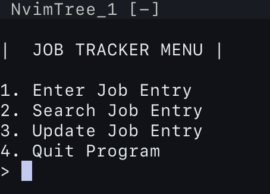

# Job Application Tracker

CLI Application Tracker to track all job application using Excel...without using Excel
Simplifies the task for you.

## INSTALL PACKAGES
Create the virtual environment: `python3 -m venv venv`
Install openpyxl: `pip3 install openpyxl`

## RUN THE PROGRAM
Currently, not in app form BUT...  
Run in the terminal by typing...`python3 jobtracker.py` 

and then read the options in the menu

